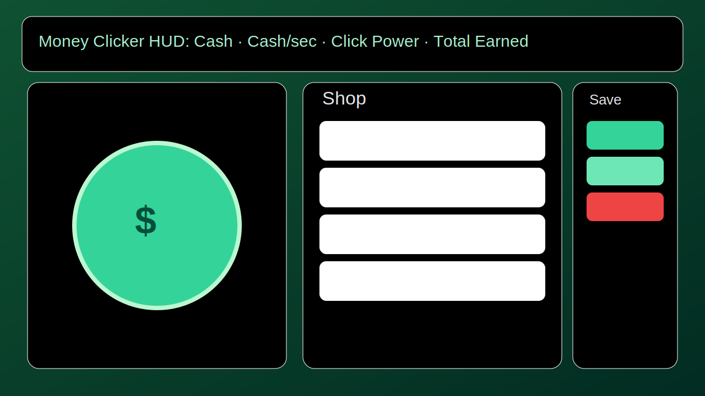

# Money Clicker

A money-themed incremental clicker game built with **Next.js + TypeScript + Tailwind CSS**.

- Tap/click to earn cash
- Buy 10+ income buildings
- Purchase upgrades to multiply click power and passive income
- Offline progression (capped at 12 hours)
- Persistent save with autosave, export/import/reset
- Mobile-friendly for tablets

[](#deploy-to-vercel)

## Screenshot



## Tech Stack

- Next.js (latest stable)
- TypeScript
- Tailwind CSS
- Client-only app (no backend)

## Local Development

```bash
npm install
npm run dev
```

Open http://localhost:3000

### Production build test

```bash
npm run build
npm start
```

---

## Publish to GitHub

> Replace `YOUR_GITHUB_USERNAME` with your username.

```bash
# from inside the money-clicker folder
git init
git branch -M main
git add .
git commit -m "Initial scaffold"

# (optional logical commits if you want to mirror implementation stages)
# git commit -m "Core gameplay"
# git commit -m "Offline progression + persistence"
# git commit -m "UI polish + assets"

gh repo create money-clicker --public --source=. --remote=origin --push
```

If you don’t use `gh`, create an empty repo in GitHub UI, then:

```bash
git remote add origin https://github.com/YOUR_GITHUB_USERNAME/money-clicker.git
git push -u origin main
```

---

## Deploy to Vercel

### Option A: Vercel GitHub Import (recommended)
1. Go to https://vercel.com/new
2. Import `money-clicker` from your GitHub account.
3. Framework preset: **Next.js** (auto-detected).
4. Keep defaults (no env vars needed).
5. Click **Deploy**.

Vercel defaults that this repo supports:
- Production deploys from `main`
- Preview deploys for pull requests

### Option B: Vercel CLI

```bash
npm i -g vercel
vercel login
vercel
vercel --prod
```

---

## Save System Notes

- `localStorage` key: `money-clicker-save-v1`
- Autosaves every 10s
- Also saves on purchase, upgrade, import/reset, tab hide, and before unload
- Corrupted/invalid save data falls back to a clean state
- Offline earnings are applied once on return using `lastSeen`

## License

MIT
